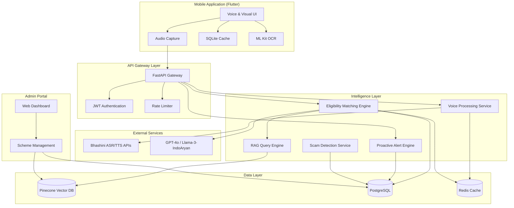
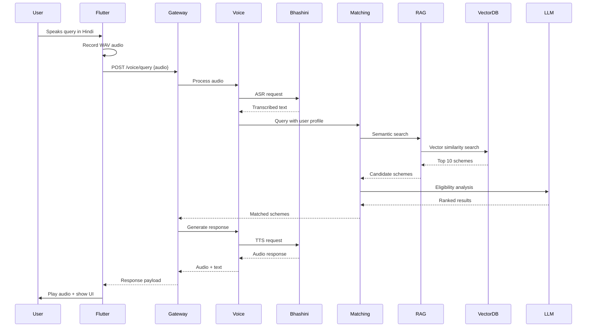

# Design Document: Government Schemes Voice Platform

## Overview

The Government Schemes Voice Platform is a mobile-first application designed to democratize access to government welfare schemes for rural and semi-urban citizens in India. The system employs a voice-first interaction model, eliminating literacy and language barriers through multilingual speech interfaces powered by Bhashini APIs. The architecture follows an offline-first approach with intelligent caching, ensuring functionality in areas with poor connectivity.

The platform consists of three primary layers:
1. **Presentation Layer**: Flutter-based mobile application with voice and visual interfaces
2. **Intelligence Layer**: FastAPI backend with LLM-powered matching and RAG-based scheme retrieval
3. **Data Layer**: Vector database for scheme embeddings and relational database for user profiles

Key design principles:
- **Voice-First**: All interactions accessible through speech, with visual UI as supplementary
- **Offline-First**: Critical functionality available without internet connectivity
- **Privacy-Centric**: End-to-end encryption with minimal data retention
- **Accessibility**: Designed for users with limited literacy and visual impairments
- **Scalability**: Architected to handle 2,500+ schemes and 100,000+ concurrent users

## Architecture

### System Architecture Diagram



### Component Interaction Flow



## Components and Interfaces

### 1. Mobile Application (Flutter)

**Responsibilities:**
- Voice capture and playback
- Local data caching for offline operation
- Document photography and OCR processing
- User profile management
- Navigation and UI rendering

**Key Modules:**

**VoiceInterface Module:**
```
class VoiceInterface {
  AudioRecorder recorder
  AudioPlayer player
  
  Future<AudioFile> recordQuery(int maxDurationSeconds)
  Future<void> playResponse(AudioFile audio, float speed)
  void cancelRecording()
  bool isRecording()
}
```

**CacheManager Module:**
```
class CacheManager {
  SQLiteDatabase db
  
  Future<void> cacheSchemes(List<Scheme> schemes)
  Future<List<Scheme>> getCachedSchemes(QueryFilter filter)
  Future<void> cacheUserProfile(UserProfile profile)
  Future<UserProfile> getUserProfile(String userId)
  Future<void> queueOfflineAction(Action action)
  Future<List<Action>> getPendingActions()
  Future<void> syncWithServer()
}
```

**DocumentScanner Module:**
```
class DocumentScanner {
  MLKitOCR ocr
  
  Future<DocumentScan> captureDocument(CameraController camera)
  Future<OCRResult> extractText(Image image)
  Future<ValidationResult> validateDocument(OCRResult result, DocumentType type)
  Future<List<ValidationIssue>> checkQuality(Image image)
}
```

**ProfileManager Module:**
```
class ProfileManager {
  Future<UserProfile> createProfile(ProfileData data)
  Future<void> updateProfile(String userId, ProfileData updates)
  Future<UserProfile> getProfile(String userId)
  Future<List<UserProfile>> getAllProfiles() // For Digital Sahayaks
  Future<void> switchProfile(String userId)
  Future<void> deleteProfile(String userId)
}
```

### 2. API Gateway (FastAPI)

**Responsibilities:**
- Request routing and load balancing
- Authentication and authorization
- Rate limiting and throttling
- Request/response transformation
- Error handling and logging

**Key Endpoints:**

```
POST /api/v1/voice/query
  Request: { audio: base64, userId: string, language: string }
  Response: { audio: base64, text: string, schemes: Scheme[] }

POST /api/v1/schemes/search
  Request: { query: string, userId: string, filters: Filter }
  Response: { schemes: Scheme[], totalCount: int, relevanceScores: float[] }

GET /api/v1/schemes/{schemeId}
  Response: { scheme: Scheme, eligibility: EligibilityDetails, documents: Document[] }

POST /api/v1/profile/create
  Request: { profileData: ProfileData }
  Response: { userId: string, profile: UserProfile }

PUT /api/v1/profile/{userId}
  Request: { updates: ProfileData }
  Response: { profile: UserProfile }

POST /api/v1/documents/validate
  Request: { image: base64, documentType: string, userId: string }
  Response: { isValid: bool, issues: ValidationIssue[], extractedData: dict }

GET /api/v1/alerts/{userId}
  Response: { alerts: Alert[], count: int }

POST /api/v1/admin/schemes
  Request: { scheme: SchemeData }
  Response: { schemeId: string, status: string }

PUT /api/v1/admin/schemes/{schemeId}
  Request: { updates: SchemeData }
  Response: { scheme: Scheme }
```

**Authentication Module:**
```
class AuthService {
  JWTManager jwt
  OTPService otp
  
  Future<AuthToken> authenticateWithOTP(string phoneNumber, string otp)
  Future<bool> validateToken(string token)
  Future<void> refreshToken(string refreshToken)
  Future<void> logout(string userId)
}
```

### 3. Voice Processing Service

**Responsibilities:**
- Integration with Bhashini ASR/TTS APIs
- Audio format conversion and validation
- Language detection and mixed-language handling
- Response caching for common phrases
- Latency management and retry logic

**VoiceProcessor Module:**
```
class VoiceProcessor {
  BhashiniClient bhashini
  RedisCache cache
  
  Future<TranscriptionResult> speechToText(AudioFile audio, string language)
  Future<AudioFile> textToSpeech(string text, string language, float speed)
  Future<string> detectLanguage(AudioFile audio)
  Future<TranscriptionResult> handleMixedLanguage(AudioFile audio)
  Future<bool> validateAudioFormat(AudioFile audio)
  Future<AudioFile> convertToWAV(AudioFile audio, int sampleRate, int bitDepth)
}
```

**BhashiniClient Module:**
```
class BhashiniClient {
  HTTPClient http
  string apiKey
  
  Future<ASRResponse> callASR(AudioFile audio, string sourceLanguage)
  Future<TTSResponse> callTTS(string text, string targetLanguage)
  Future<void> retryWithBackoff(Function apiCall, int maxRetries)
  Future<HealthStatus> checkAPIHealth()
}
```

### 4. Eligibility Matching Engine

**Responsibilities:**
- Semantic search using RAG architecture
- LLM-powered eligibility analysis
- Ranking and scoring of matched schemes
- Handling complex eligibility rules
- Generating explanations for matches/non-matches

**MatchingEngine Module:**
```
class MatchingEngine {
  RAGQueryEngine rag
  LLMClient llm
  EligibilityRuleEngine rules
  
  Future<List<SchemeMatch>> findEligibleSchemes(UserProfile profile, string query)
  Future<float> calculateEligibilityScore(Scheme scheme, UserProfile profile)
  Future<List<SchemeMatch>> rankSchemes(List<Scheme> candidates, UserProfile profile)
  Future<string> explainMatch(Scheme scheme, UserProfile profile)
  Future<List<Scheme>> findNearMatches(UserProfile profile, List<string> missingCriteria)
}
```

**RAGQueryEngine Module:**
```
class RAGQueryEngine {
  VectorDBClient vectorDB
  EmbeddingModel embedder
  
  Future<List<Scheme>> semanticSearch(string query, int topK)
  Future<Vector> generateQueryEmbedding(string query)
  Future<List<Scheme>> hybridSearch(string query, Filter filter, int topK)
  Future<void> indexScheme(Scheme scheme)
  Future<void> updateSchemeEmbedding(string schemeId, Scheme updatedScheme)
}
```

**EligibilityRuleEngine Module:**
```
class EligibilityRuleEngine {
  Future<bool> evaluateRule(Rule rule, UserProfile profile)
  Future<List<Rule>> parseEligibilityCriteria(string criteria)
  Future<List<string>> identifyMissingCriteria(Scheme scheme, UserProfile profile)
  Future<bool> checkAgeEligibility(AgeRange range, int userAge)
  Future<bool> checkIncomeEligibility(IncomeRange range, float userIncome)
  Future<bool> checkLocationEligibility(List<string> locations, string userLocation)
}
```

### 5. Proactive Alert Engine

**Responsibilities:**
- Monitoring user profiles for life stage changes
- Detecting new scheme additions
- Generating timely notifications
- Managing alert delivery across channels (app, SMS)
- Preventing duplicate alerts

**AlertEngine Module:**
```
class AlertEngine {
  ProfileMonitor monitor
  NotificationService notifier
  AlertRepository repo
  
  Future<void> scanForLifeStageChanges()
  Future<List<Alert>> generateAlertsForProfile(UserProfile profile)
  Future<void> scheduleAlert(Alert alert, DateTime deliveryTime)
  Future<void> deliverAlert(Alert alert, List<Channel> channels)
  Future<bool> isDuplicateAlert(Alert alert, string userId)
  Future<void> markAlertAsDelivered(string alertId)
}
```

**ProfileMonitor Module:**
```
class ProfileMonitor {
  Future<List<LifeStageEvent>> detectUpcomingEvents(UserProfile profile)
  Future<bool> isChildTurning18(UserProfile profile, int daysAhead)
  Future<bool> isPregnancyInThirdTrimester(UserProfile profile)
  Future<List<Scheme>> findNewMatchingSchemes(UserProfile profile, DateTime since)
  Future<void> updateMonitoringSchedule(string userId, List<EventType> events)
}
```

### 6. Document Auditor Service

**Responsibilities:**
- OCR processing of uploaded documents
- Quality assessment (blur, lighting, completeness)
- Field extraction and validation
- Name matching against user profile
- Document type classification

**DocumentAuditor Module:**
```
class DocumentAuditor {
  OCREngine ocr
  QualityChecker quality
  FieldExtractor extractor
  
  Future<AuditResult> auditDocument(Image image, DocumentType expectedType)
  Future<QualityScore> assessQuality(Image image)
  Future<Map<string, string>> extractFields(Image image, DocumentType type)
  Future<bool> validateNameMatch(string documentName, string profileName)
  Future<List<ValidationIssue>> checkCompleteness(Map<string, string> fields, DocumentType type)
  Future<DocumentType> classifyDocument(Image image)
}
```

**QualityChecker Module:**
```
class QualityChecker {
  Future<float> calculateBlurScore(Image image)
  Future<float> calculateBrightnessScore(Image image)
  Future<bool> areAllCornersVisible(Image image)
  Future<bool> isTextReadable(Image image)
  Future<List<QualityIssue>> identifyIssues(Image image)
}
```

### 7. Scam Detection Service

**Responsibilities:**
- Validating scheme sources (.gov.in domains)
- Detecting payment requests in free schemes
- Identifying suspicious patterns
- Generating warnings and alerts
- Logging potential scam attempts

**ScamDetector Module:**
```
class ScamDetector {
  DomainValidator validator
  PatternMatcher matcher
  
  Future<bool> isOfficialSource(string url)
  Future<bool> requiresPayment(Scheme scheme)
  Future<ScamRisk> assessRisk(Scheme scheme)
  Future<void> logSuspiciousActivity(string userId, string activity)
  Future<List<ScamPattern>> detectPatterns(string content)
  Future<Warning> generateWarning(ScamRisk risk)
}
```

### 8. Scheme Database Management

**Responsibilities:**
- CRUD operations for schemes
- Version control and audit trails
- Bulk import/export
- Eligibility criteria parsing
- Triggering re-evaluation on updates

**SchemeManager Module:**
```
class SchemeManager {
  PostgreSQLClient db
  VectorDBClient vectorDB
  VersionControl versions
  
  Future<string> createScheme(SchemeData data)
  Future<void> updateScheme(string schemeId, SchemeData updates)
  Future<void> deleteScheme(string schemeId)
  Future<Scheme> getScheme(string schemeId)
  Future<List<Scheme>> getAllSchemes(Filter filter, Pagination page)
  Future<void> bulkImport(List<SchemeData> schemes)
  Future<void> markAsExpired(string schemeId)
  Future<List<Version>> getSchemeHistory(string schemeId)
}
```

## Data Models

### UserProfile
```
{
  userId: string (UUID)
  phoneNumber: string (encrypted)
  name: string (encrypted)
  age: int
  dateOfBirth: date
  gender: enum [Male, Female, Other]
  income: float
  location: {
    state: string
    district: string
    block: string
    village: string
    pincode: string
    gpsCoordinates: { lat: float, lon: float }
  }
  casteCategory: enum [General, OBC, SC, ST, EWS]
  disabilityStatus: {
    hasDisability: bool
    disabilityType: string
    disabilityPercentage: int
  }
  familyComposition: {
    maritalStatus: enum [Single, Married, Widowed, Divorced]
    numberOfChildren: int
    childrenAges: int[]
    dependents: int
    isPregnant: bool
    pregnancyTrimester: int
  }
  occupation: string
  educationLevel: enum [Illiterate, Primary, Secondary, HigherSecondary, Graduate, Postgraduate]
  languagePreference: string
  createdAt: timestamp
  updatedAt: timestamp
  managedBy: string (userId of Digital Sahayak, null if self-managed)
}
```

### Scheme
```
{
  schemeId: string (UUID)
  name: string
  nameTranslations: map<string, string> // language -> translated name
  description: string
  descriptionTranslations: map<string, string>
  category: enum [Health, Education, Agriculture, Housing, Employment, Social_Welfare, Financial_Inclusion]
  launchingDepartment: string
  officialUrl: string
  eligibilityCriteria: {
    ageRange: { min: int, max: int }
    incomeRange: { min: float, max: float }
    genderRequirement: enum [Any, Male, Female, Other]
    locationRequirements: string[] // states/districts
    casteRequirements: enum[] // [General, OBC, SC, ST, EWS]
    disabilityRequired: bool
    occupationRequirements: string[]
    educationRequirements: enum[]
    customRules: string // Natural language rules for LLM parsing
  }
  benefits: {
    type: enum [Cash, Subsidy, Service, Product]
    amount: float
    description: string
  }
  requiredDocuments: {
    documentType: enum [Aadhaar, RationCard, IncomeCertificate, CasteCertificate, DisabilityCertificate, BankPassbook, Other]
    isMandatory: bool
    description: string
  }[]
  applicationProcess: {
    steps: string[]
    estimatedTimeline: string
    officeVisitRequired: bool
    onlineApplicationUrl: string
  }
  deadlines: {
    applicationStart: date
    applicationEnd: date
    isOngoing: bool
  }
  embedding: float[] // Vector embedding for RAG
  isActive: bool
  createdAt: timestamp
  updatedAt: timestamp
  version: int
}
```

### SchemeMatch
```
{
  scheme: Scheme
  eligibilityScore: float // 0.0 to 1.0
  matchReason: string
  missingCriteria: string[]
  confidenceLevel: enum [High, Medium, Low]
  estimatedBenefit: float
  applicationDeadline: date
  priorityRank: int
}
```

### Alert
```
{
  alertId: string (UUID)
  userId: string
  type: enum [LifeStageChange, NewScheme, DeadlineReminder, DocumentExpiry]
  title: string
  message: string
  relatedSchemeId: string
  triggerDate: date
  deliveryDate: timestamp
  channels: enum[] [App, SMS, Email]
  isRead: bool
  isDismissed: bool
  createdAt: timestamp
}
```

### Document
```
{
  documentId: string (UUID)
  userId: string
  documentType: enum [Aadhaar, RationCard, IncomeCertificate, CasteCertificate, DisabilityCertificate, BankPassbook, Other]
  imageUrl: string (encrypted storage)
  ocrData: {
    extractedText: string
    fields: map<string, string>
    confidence: float
  }
  validationStatus: enum [Pending, Valid, Invalid, NeedsRetake]
  validationIssues: ValidationIssue[]
  uploadedAt: timestamp
  validatedAt: timestamp
  expiryDate: date
}
```

### ValidationIssue
```
{
  issueType: enum [Blur, LowLight, NameMismatch, MissingField, Unreadable, WrongDocumentType]
  severity: enum [Critical, Warning, Info]
  message: string
  suggestion: string
}
```

### OfflineAction
```
{
  actionId: string (UUID)
  userId: string
  actionType: enum [ProfileUpdate, DocumentUpload, SchemeQuery, AlertDismissal]
  payload: json
  createdAt: timestamp
  syncStatus: enum [Pending, Synced, Failed]
  retryCount: int
}
```

## Correctness Properties

*A property is a characteristic or behavior that should hold true across all valid executions of a system—essentially, a formal statement about what the system should do. Properties serve as the bridge between human-readable specifications and machine-verifiable correctness guarantees.*


### Property Reflection

After analyzing all acceptance criteria, I've identified several areas where properties can be consolidated:

**Consolidation Opportunities:**
1. **Voice Processing (1.1-1.5, 2.1-2.5)**: Multiple properties about voice input/output can be grouped by functionality (format validation, performance, error handling)
2. **Data Persistence (3.3, 3.5, 9.3, 9.6)**: Properties about data storage and caching can be combined into comprehensive persistence properties
3. **Profile Management (3.2, 10.1-10.5)**: Digital Sahayak profile operations share common patterns
4. **Document Validation (6.1-6.6)**: All document auditor properties test the same validation pipeline
5. **Security Properties (13.1-13.6)**: Encryption and authentication properties can be grouped by security domain
6. **Performance Properties (1.1, 4.4, 6.1, 9.5, 10.2, 14.4)**: Multiple timing requirements can be consolidated
7. **Alert Properties (5.1-5.5)**: All alert generation and delivery properties test the same alert system
8. **Offline Properties (9.1-9.6)**: Offline functionality properties share common offline/online transition patterns

**Redundancy Elimination:**
- Properties 1.3 and 16.1 both test WAV format validation - combine into one comprehensive property
- Properties 3.3 and 9.3 both test data persistence - combine into one property covering online and offline
- Properties 8.1, 8.2, 8.3 all test scam detection - combine into comprehensive scam detection property
- Properties 7.1-7.6 all test application guidance - combine into fewer comprehensive properties

**Final Property Set:**
After reflection, I will create properties that:
1. Provide unique validation value
2. Avoid logical redundancy
3. Cover all testable acceptance criteria
4. Group related behaviors into comprehensive properties

### Correctness Properties

**Property 1: Voice Input Format Compliance**
*For any* audio input sent to the Voice_Engine, the audio must be in WAV format with 16kHz sample rate and 16-bit depth before being sent to Bhashini APIs.
**Validates: Requirements 1.3, 16.1**

**Property 2: Voice Processing Performance**
*For any* voice query in any supported language, the Voice_Engine must complete speech-to-text conversion and return results within 5 seconds.
**Validates: Requirements 1.1, 4.4**

**Property 3: Mixed Language Intent Extraction**
*For any* Mixed_Language_Input combining two or more supported languages, the Voice_Engine must correctly extract the user's intent and return relevant scheme matches.
**Validates: Requirements 1.2**

**Property 4: Low Quality Audio Handling**
*For any* audio input with insufficient quality (signal-to-noise ratio below threshold), the Voice_Engine must prompt the user to repeat the query rather than proceeding with inaccurate transcription.
**Validates: Requirements 1.5**

**Property 5: Processing Indicator Display**
*For any* speech-to-text or text-to-speech operation in progress, the Platform must display a "Processing" indicator within 1 second of operation start.
**Validates: Requirements 1.4, 16.2**

**Property 6: Text-to-Speech Fallback**
*For any* text-to-speech conversion failure, the Platform must display the text response as a fallback within 2 seconds of failure detection.
**Validates: Requirements 2.5**

**Property 7: Multi-Scheme Audio Formatting**
*For any* query result containing multiple schemes, the Voice_Engine must provide audio summaries with clear separators (pauses or verbal markers) between each scheme.
**Validates: Requirements 2.4**

**Property 8: Profile Data Persistence**
*For any* User_Profile update (online or offline), the Platform must persist changes to local storage immediately, and if offline, queue for server synchronization when connectivity is restored.
**Validates: Requirements 3.3, 9.3**

**Property 9: Profile Switching Without Re-authentication**
*For any* Digital_Sahayak managing multiple profiles, switching between any two profiles must complete within 2 seconds without requiring re-authentication.
**Validates: Requirements 3.2, 10.2**

**Property 10: Profile Validation Completeness**
*For any* User_Profile creation or modification, the Platform must validate that all required fields (age, income, gender, location, caste category, disability status, family composition) are complete before allowing save.
**Validates: Requirements 3.4**

**Property 11: Sensitive Data Encryption at Rest**
*For any* User_Profile containing sensitive information (name, phone number, documents), the Platform must encrypt the data at rest using AES-256 encryption.
**Validates: Requirements 3.5, 13.2**

**Property 12: Comprehensive Eligibility Evaluation**
*For any* scheme matching query, the Matching_Engine must evaluate all eligibility factors (age, income, gender, location, caste, disability, family composition) against the User_Profile.
**Validates: Requirements 4.1, 4.2**

**Property 13: Scheme Ranking by Relevance**
*For any* query returning multiple matching schemes, the Platform must rank results by relevance score calculated from benefit amount and application deadline proximity, with higher scores appearing first.
**Validates: Requirements 4.3**

**Property 14: Near-Match Suggestions**
*For any* query where no schemes match the User_Profile exactly, the Platform must suggest the closest matching schemes with explanations of which eligibility criteria are missing.
**Validates: Requirements 4.5**

**Property 15: Proactive Alert Generation Timing**
*For any* User_Profile with an upcoming life stage change (child turning 18, pregnancy entering third trimester), the Platform must generate a Proactive_Alert notification 30 days before the eligibility date.
**Validates: Requirements 5.1**

**Property 16: New Scheme Alert Generation**
*For any* new scheme added to the Scheme_Database that matches an existing User_Profile, the Platform must generate and deliver a notification to the Beneficiary within 24 hours.
**Validates: Requirements 5.2**

**Property 17: Alert Content Completeness**
*For any* Proactive_Alert generated, the alert must include the scheme name, eligibility date, and list of required documents.
**Validates: Requirements 5.3**

**Property 18: Alert Deduplication**
*For any* alert dismissed by a Beneficiary, the Platform must not generate the same alert again unless the underlying eligibility criteria change.
**Validates: Requirements 5.5**

**Property 19: Multi-Channel Alert Delivery**
*For any* alert generated, the Platform must deliver it through the app interface, and if the user is offline or using a feature phone, must also send via SMS.
**Validates: Requirements 5.4, 18.4**

**Property 20: Document OCR Performance**
*For any* document photo upload (2-5 MB), the Document_Auditor must complete OCR analysis and return results within 5 seconds.
**Validates: Requirements 6.1, 14.4**

**Property 21: Document Name Validation**
*For any* document processed by the Document_Auditor, the Platform must check for name mismatches between the extracted document name and the User_Profile name, flagging mismatches as validation issues.
**Validates: Requirements 6.2**

**Property 22: Document Quality Assessment**
*For any* document photo that is blurry, poorly lit, or has missing corners, the Document_Auditor must detect the quality issues and prompt the Beneficiary to retake the photo.
**Validates: Requirements 6.3**

**Property 23: Document Field Completeness**
*For any* document of a known type (Aadhaar, Ration Card, Income Certificate, Caste Certificate), the Document_Auditor must verify that all required fields for that document type are visible and readable.
**Validates: Requirements 6.4**

**Property 24: Document Field Extraction**
*For any* validated document of a supported type, the Document_Auditor must extract key fields (name, ID number, date, issuing authority) for auto-filling application forms.
**Validates: Requirements 6.6**

**Property 25: Application Guidance Completeness**
*For any* scheme selected for application, the Platform must provide Application_Guidance containing numbered steps, required documents list, estimated timelines, and GPS directions if office visits are required.
**Validates: Requirements 7.1, 7.2, 7.4, 7.6**

**Property 26: Application Step Progression**
*For any* application step marked as complete by a Beneficiary, the Platform must update the step status and automatically advance to the next step in the sequence.
**Validates: Requirements 7.3**

**Property 27: Scam Detection and Warning**
*For any* scheme displayed to users, the Platform must verify the source is from an official .gov.in domain, and if the scheme requires payment or links to non-official websites, must issue both audio and visual Scam_Warning alerts and block access.
**Validates: Requirements 8.1, 8.2, 8.3, 8.4**

**Property 28: Suspicious Activity Logging**
*For any* detected suspicious pattern (payment requests, non-official URLs, requests for passwords), the Platform must log the incident with user context and alert Administrators.
**Validates: Requirements 8.5**

**Property 29: Offline Operation with Cache**
*For any* query or operation when internet connectivity is unavailable, the Platform must operate using Offline_Cache for previously loaded data and queue any updates for synchronization.
**Validates: Requirements 9.1, 9.2**

**Property 30: Offline-to-Online Synchronization**
*For any* Platform instance that returns online after being offline, all queued changes must synchronize with the server within 60 seconds without data loss.
**Validates: Requirements 9.5, 14.5**

**Property 31: SMS Fallback for Critical Alerts**
*For any* critical alert when the Platform detects no internet connectivity, the Platform must deliver the alert via SMS using stored phone numbers.
**Validates: Requirements 9.4**

**Property 32: Automatic Data Caching**
*For any* critical scheme data loaded during online operation, the Platform must automatically cache it to local storage for offline access.
**Validates: Requirements 9.6**

**Property 33: Digital Sahayak Profile Listing**
*For any* Digital_Sahayak login, the Platform must display a list of all managed Beneficiary profiles showing name, eligibility summary, and pending actions.
**Validates: Requirements 10.1, 10.4**

**Property 34: Profile Creation Linking**
*For any* new Beneficiary profile created by a Digital_Sahayak, the Platform must link the profile to the Digital_Sahayak's account for management and audit purposes.
**Validates: Requirements 10.3**

**Property 35: Digital Sahayak Action Auditing**
*For any* action performed by a Digital_Sahayak on behalf of a Beneficiary, the Platform must log the action with the Digital_Sahayak's identifier, timestamp, and action details.
**Validates: Requirements 10.5**

**Property 36: Scheme Data Validation**
*For any* scheme added or updated by an Administrator, the Platform must validate that all required fields (name, eligibility criteria, benefits, deadlines, required documents) are provided before committing changes.
**Validates: Requirements 11.1, 11.5**

**Property 37: Eligibility Re-evaluation on Update**
*For any* scheme eligibility criteria update, the Platform must re-evaluate all User_Profiles and generate Proactive_Alert notifications for Beneficiaries who become newly eligible.
**Validates: Requirements 11.2**

**Property 38: Scheme Expiration Handling**
*For any* scheme marked as expired by an Administrator, the Platform must remove it from active search results within 1 hour.
**Validates: Requirements 11.3**

**Property 39: Scheme Version History**
*For any* modification to scheme data, the Platform must create and store a new version entry with timestamp, modifier identity, and change details.
**Validates: Requirements 11.4**

**Property 40: GPS-Based Office Location**
*For any* request for government office locations, the Platform must use the Beneficiary's GPS coordinates to identify and return the nearest offices with name, address, distance, and operating hours.
**Validates: Requirements 12.1, 12.2**

**Property 41: Office Location Fallback**
*For any* location where specific office information is unavailable, the Platform must display the district headquarters office as a fallback option.
**Validates: Requirements 12.4**

**Property 42: Location Permission Request**
*For any* attempt to access GPS location data, the Platform must request explicit permission from the Beneficiary before accessing the device location.
**Validates: Requirements 12.5**

**Property 43: Data Transmission Encryption**
*For any* User_Profile data transmitted between the mobile app and backend, the Platform must encrypt all data using TLS 1.3 or higher.
**Validates: Requirements 13.1**

**Property 44: OTP Authentication**
*For any* login attempt, the Platform must support authentication via OTP sent to the registered mobile number, validating the OTP before granting access.
**Validates: Requirements 13.3**

**Property 45: Session Timeout**
*For any* user session inactive for 15 minutes, the Platform must automatically log out the user and clear session data.
**Validates: Requirements 13.4**

**Property 46: Device Permission Requests**
*For any* access to device features (camera, microphone, location, storage), the Platform must request explicit permissions with clear explanations of why the permission is needed.
**Validates: Requirements 13.5**

**Property 47: Account Deletion Data Removal**
*For any* Beneficiary account deletion request, the Platform must permanently remove all associated data (profile, documents, logs) within 30 days.
**Validates: Requirements 13.6**

**Property 48: Voice Navigation Accessibility**
*For any* navigation action in the Platform, the action must be completable using voice commands alone without requiring text reading or visual interaction.
**Validates: Requirements 15.1**

**Property 49: Visual Accessibility Standards**
*For any* visual element displayed, the Platform must use high-contrast colors (minimum 4.5:1 ratio) and large fonts (minimum 16pt) for readability.
**Validates: Requirements 15.2**

**Property 50: Choice Limitation**
*For any* screen presenting choices to the user, the Platform must limit options to 5 or fewer to avoid cognitive overload.
**Validates: Requirements 15.3**

**Property 51: Icon-Text Pairing**
*For any* instruction or action button displayed, the Platform must include both a visual icon and text label for universal comprehension.
**Validates: Requirements 15.5**

**Property 52: Bhashini Confidence Score Handling**
*For any* transcription result received from Bhashini APIs with multiple interpretations, the Platform must select the interpretation with the highest confidence score.
**Validates: Requirements 16.3**

**Property 53: Bhashini API Retry Logic**
*For any* Bhashini API call that fails or times out, the Platform must retry up to 3 times with exponential backoff before returning an error to the user.
**Validates: Requirements 16.4**

**Property 54: TTS Phrase Caching**
*For any* text-to-speech request for frequently used phrases (greetings, common instructions), the Platform must check the cache first and only call Bhashini TTS if not cached.
**Validates: Requirements 16.5**

**Property 55: Usage Logging**
*For any* user interaction with the Platform, the system must log query type, response time, and success/failure status for analytics.
**Validates: Requirements 17.1**

**Property 56: Error Capture**
*For any* error that occurs during Platform operation, the system must capture error details, stack trace, and anonymized user context for debugging.
**Validates: Requirements 17.2**

**Property 57: Analytics Data Anonymization**
*For any* analytics data generated from User_Profile information, the Platform must anonymize personally identifiable information before storage or analysis.
**Validates: Requirements 17.3**

**Property 58: Critical Error Alerting**
*For any* time period where critical errors exceed 5% of total requests, the Platform must send alerts to Administrators via email and SMS.
**Validates: Requirements 17.6**

**Property 59: SMS Query Processing**
*For any* SMS query received from a feature phone user, the Platform must parse the text, search for matching schemes, and return results via SMS within 30 seconds.
**Validates: Requirements 18.2**

**Property 60: SMS Message Splitting**
*For any* SMS response exceeding 160 characters, the Platform must split the message into multiple parts with clear numbering (e.g., "1/3", "2/3", "3/3").
**Validates: Requirements 18.3**

**Property 61: SMS Delivery Retry**
*For any* SMS delivery failure, the Platform must retry up to 3 times over 24 hours with exponential backoff before marking as permanently failed.
**Validates: Requirements 18.5**

## Error Handling

### Error Categories and Handling Strategies

**1. Voice Processing Errors**

*Audio Format Errors:*
- **Detection**: Validate audio format, sample rate, and bit depth before processing
- **Handling**: Convert to required format if possible, otherwise prompt user to re-record
- **User Message**: "Audio format not supported. Please try recording again."

*Bhashini API Errors:*
- **Detection**: Monitor API response codes and timeouts
- **Handling**: Retry with exponential backoff (3 attempts), fall back to cached responses for common phrases
- **User Message**: "Voice service temporarily unavailable. Showing text instead."

*Low Confidence Transcription:*
- **Detection**: Check confidence scores from Bhashini ASR
- **Handling**: If confidence < 0.7, prompt user to repeat; if 0.7-0.85, show transcription for confirmation
- **User Message**: "I didn't catch that clearly. Could you please repeat?"

**2. Network and Connectivity Errors**

*No Internet Connection:*
- **Detection**: Monitor network status changes
- **Handling**: Switch to offline mode, use cached data, queue operations for sync
- **User Message**: "You're offline. Using cached data. Changes will sync when online."

*API Timeout:*
- **Detection**: Set timeout thresholds (5s for voice, 10s for scheme search)
- **Handling**: Retry with backoff, fall back to cached results if available
- **User Message**: "Taking longer than usual. Please wait..."

*Sync Failures:*
- **Detection**: Monitor sync operation results
- **Handling**: Retry failed operations, maintain queue, alert user if queue exceeds 100 items
- **User Message**: "Some changes couldn't sync. Will retry automatically."

**3. Data Validation Errors**

*Incomplete Profile:*
- **Detection**: Validate required fields before save
- **Handling**: Highlight missing fields, prevent save until complete
- **User Message**: "Please provide: [list of missing fields]"

*Invalid Document:*
- **Detection**: OCR quality checks, field validation
- **Handling**: Provide specific feedback on issues, suggest retake
- **User Message**: "Photo is blurry. Please retake in good lighting."

*Name Mismatch:*
- **Detection**: Compare extracted name with profile name (fuzzy matching)
- **Handling**: Flag for review, allow user to confirm if intentional
- **User Message**: "Name on document doesn't match profile. Is this correct?"

**4. Authentication and Authorization Errors**

*Invalid OTP:*
- **Detection**: Validate OTP against generated code
- **Handling**: Allow 3 attempts, then require new OTP generation
- **User Message**: "Incorrect OTP. [X] attempts remaining."

*Session Expired:*
- **Detection**: Check session timestamp on each request
- **Handling**: Clear session, redirect to login, preserve unsaved work in cache
- **User Message**: "Session expired for security. Please log in again."

*Permission Denied:*
- **Detection**: Check device permissions before accessing features
- **Handling**: Show permission rationale, guide user to settings if needed
- **User Message**: "Camera access needed to scan documents. Enable in settings?"

**5. Business Logic Errors**

*No Matching Schemes:*
- **Detection**: Empty result set from matching engine
- **Handling**: Suggest near-matches, explain missing criteria, offer to update profile
- **User Message**: "No exact matches found. Here are similar schemes you might qualify for soon."

*Scheme Expired:*
- **Detection**: Check application deadline against current date
- **Handling**: Mark as expired, suggest similar active schemes
- **User Message**: "This scheme's deadline has passed. Here are similar active schemes."

*Document Already Uploaded:*
- **Detection**: Check for existing document of same type
- **Handling**: Offer to replace or keep existing, show comparison
- **User Message**: "You already uploaded this document. Replace with new one?"

**6. External Service Errors**

*Bhashini Service Down:*
- **Detection**: Health check failures, repeated API errors
- **Handling**: Fall back to text-only mode, cache requests for retry
- **User Message**: "Voice service unavailable. Using text mode."

*SMS Gateway Failure:*
- **Detection**: SMS delivery status callbacks
- **Handling**: Retry with different gateway if available, log for manual follow-up
- **User Message**: "SMS couldn't be sent. Please check your phone number."

*GPS Service Unavailable:*
- **Detection**: Location API errors
- **Handling**: Fall back to manual location entry, use last known location
- **User Message**: "Can't detect location. Please enter manually."

**7. System Errors**

*Database Connection Lost:*
- **Detection**: Database query failures
- **Handling**: Retry with connection pool, fall back to read-only cache
- **User Message**: "Service temporarily unavailable. Please try again."

*Out of Memory:*
- **Detection**: Monitor memory usage, catch OOM exceptions
- **Handling**: Clear caches, reduce image quality, restart service
- **User Message**: "App needs to restart. Your data is saved."

*Disk Space Full:*
- **Detection**: Check available storage before caching
- **Handling**: Clear old cache entries, prompt user to free space
- **User Message**: "Storage almost full. Please free up space."

### Error Logging and Monitoring

**Log Levels:**
- **ERROR**: System failures requiring immediate attention
- **WARN**: Degraded functionality, retryable failures
- **INFO**: Normal operations, successful recoveries
- **DEBUG**: Detailed diagnostic information

**Logged Information:**
- Error type and message
- Stack trace (for exceptions)
- User context (anonymized user ID, action attempted)
- System state (memory, network, cache status)
- Timestamp and request ID

**Monitoring Alerts:**
- Critical error rate > 5%: Immediate SMS/email to admins
- API latency > 10s: Warning alert
- Offline sync queue > 100: Warning alert
- Bhashini API failures > 20%: Critical alert

## Testing Strategy

### Dual Testing Approach

The platform requires both **unit testing** and **property-based testing** to ensure comprehensive coverage. These approaches are complementary:

- **Unit tests** verify specific examples, edge cases, and integration points
- **Property tests** verify universal properties across all inputs through randomization

### Unit Testing

**Focus Areas:**
- Specific examples demonstrating correct behavior
- Integration points between components (API contracts, database schemas)
- Edge cases and boundary conditions
- Error conditions and exception handling

**Example Unit Tests:**

*Voice Processing:*
- Test that Hindi audio file is correctly transcribed to expected text
- Test that empty audio file returns appropriate error
- Test that audio file exceeding size limit is rejected

*Scheme Matching:*
- Test that a 65-year-old woman from Maharashtra matches "Senior Citizen Pension Scheme"
- Test that a user with income above threshold is excluded from "Below Poverty Line" schemes
- Test that expired schemes are not returned in search results

*Document Validation:*
- Test that a clear Aadhaar card photo extracts name and number correctly
- Test that a blurry image is flagged for retake
- Test that name "Rajesh Kumar" matches "Rajesh Kumar Singh" with fuzzy matching

**Unit Test Organization:**
```
tests/
  unit/
    voice/
      test_audio_format_validation.py
      test_bhashini_client.py
      test_language_detection.py
    matching/
      test_eligibility_rules.py
      test_scheme_ranking.py
      test_rag_query.py
    documents/
      test_ocr_extraction.py
      test_quality_assessment.py
      test_name_matching.py
    offline/
      test_cache_manager.py
      test_sync_logic.py
```

### Property-Based Testing

**Configuration:**
- Minimum 100 iterations per property test (due to randomization)
- Use fast-check (JavaScript/TypeScript) or Hypothesis (Python)
- Each test must reference its design document property in a comment tag

**Tag Format:**
```python
# Feature: government-schemes-voice-platform, Property 1: Voice Input Format Compliance
def test_voice_input_format_compliance():
    ...
```

**Property Test Implementation Patterns:**

*Pattern 1: Format Validation Properties*
```python
# Feature: government-schemes-voice-platform, Property 1: Voice Input Format Compliance
@given(audio_file=audio_generator())
def test_voice_input_format_compliance(audio_file):
    """For any audio input, verify WAV format with 16kHz/16-bit before Bhashini"""
    processed = voice_processor.prepare_for_bhashini(audio_file)
    assert processed.format == "WAV"
    assert processed.sample_rate == 16000
    assert processed.bit_depth == 16
```

*Pattern 2: Round-Trip Properties*
```python
# Feature: government-schemes-voice-platform, Property 30: Offline-to-Online Synchronization
@given(actions=st.lists(offline_action_generator(), min_size=1, max_size=100))
def test_offline_sync_preserves_data(actions):
    """For any queued offline actions, syncing must preserve all data without loss"""
    cache_manager.queue_actions(actions)
    cache_manager.go_offline()
    cache_manager.go_online()
    cache_manager.sync()
    
    synced_actions = get_synced_actions_from_server()
    assert len(synced_actions) == len(actions)
    for original, synced in zip(actions, synced_actions):
        assert original.payload == synced.payload
```

*Pattern 3: Invariant Properties*
```python
# Feature: government-schemes-voice-platform, Property 13: Scheme Ranking by Relevance
@given(profile=user_profile_generator(), schemes=st.lists(scheme_generator(), min_size=2))
def test_scheme_ranking_order(profile, schemes):
    """For any multi-scheme result, ranking must be in descending relevance score order"""
    matches = matching_engine.find_eligible_schemes(profile, schemes)
    
    # Invariant: scores must be in descending order
    scores = [m.eligibility_score for m in matches]
    assert scores == sorted(scores, reverse=True)
```

*Pattern 4: Error Handling Properties*
```python
# Feature: government-schemes-voice-platform, Property 4: Low Quality Audio Handling
@given(audio=low_quality_audio_generator())
def test_low_quality_audio_prompts_retry(audio):
    """For any low-quality audio, system must prompt retry rather than proceed"""
    result = voice_processor.process_audio(audio)
    
    assert result.status == "RETRY_REQUIRED"
    assert result.user_message is not None
    assert "repeat" in result.user_message.lower()
```

*Pattern 5: State Transition Properties*
```python
# Feature: government-schemes-voice-platform, Property 26: Application Step Progression
@given(scheme=scheme_generator(), step_index=st.integers(min_value=0, max_value=10))
def test_step_completion_advances(scheme, step_index):
    """For any completed step, system must advance to next step"""
    application = create_application(scheme)
    if step_index < len(application.steps):
        application.complete_step(step_index)
        
        assert application.steps[step_index].status == "COMPLETED"
        if step_index + 1 < len(application.steps):
            assert application.current_step == step_index + 1
```

**Property Test Organization:**
```
tests/
  properties/
    test_voice_properties.py
    test_matching_properties.py
    test_document_properties.py
    test_offline_properties.py
    test_security_properties.py
    test_alert_properties.py
```

### Integration Testing

**Focus Areas:**
- End-to-end user flows (voice query → scheme match → document upload → application guidance)
- External service integration (Bhashini APIs, SMS gateway, GPS services)
- Database transactions and data consistency
- Offline-to-online transitions

**Example Integration Tests:**
- Complete voice query flow from audio capture to TTS response
- Profile creation by Digital Sahayak and subsequent scheme matching
- Document upload, OCR, validation, and auto-fill workflow
- Offline operation, queue building, and synchronization on reconnect

### Test Data Generation

**Generators for Property Tests:**

*User Profile Generator:*
```python
@st.composite
def user_profile_generator(draw):
    return UserProfile(
        age=draw(st.integers(min_value=0, max_value=120)),
        income=draw(st.floats(min_value=0, max_value=1000000)),
        gender=draw(st.sampled_from(["Male", "Female", "Other"])),
        location=draw(location_generator()),
        caste_category=draw(st.sampled_from(["General", "OBC", "SC", "ST", "EWS"])),
        # ... other fields
    )
```

*Scheme Generator:*
```python
@st.composite
def scheme_generator(draw):
    return Scheme(
        name=draw(st.text(min_size=10, max_size=100)),
        eligibility_criteria=draw(eligibility_criteria_generator()),
        benefits=draw(benefits_generator()),
        deadline=draw(st.dates(min_value=date.today())),
        # ... other fields
    )
```

*Audio File Generator:*
```python
@st.composite
def audio_generator(draw):
    sample_rate = draw(st.sampled_from([8000, 16000, 44100, 48000]))
    bit_depth = draw(st.sampled_from([8, 16, 24, 32]))
    duration = draw(st.floats(min_value=0.1, max_value=60))
    return generate_audio_file(sample_rate, bit_depth, duration)
```

### Test Coverage Goals

- **Unit Test Coverage**: Minimum 80% code coverage
- **Property Test Coverage**: All 61 correctness properties implemented
- **Integration Test Coverage**: All critical user flows covered
- **Edge Case Coverage**: All identified edge cases from requirements tested

### Continuous Testing

- Run unit tests on every commit
- Run property tests (100 iterations) on every pull request
- Run full property test suite (1000 iterations) nightly
- Run integration tests before deployment
- Monitor production errors and add regression tests

